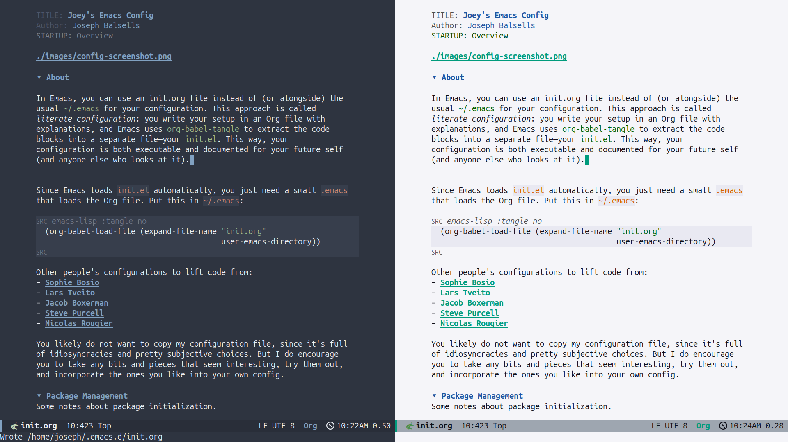

```{=org}
#+STARTUP: Overview
```


# About

In Emacs, you can use an init.org file instead of (or alongside) the
usual `~/.emacs`{.verbatim} for your configuration. This approach is
called *literate configuration*: you write your setup in an Org file
with explanations, and Emacs uses `org-babel-tangle`{.verbatim} to
extract the code blocks into a separate file---your
`init.el`{.verbatim}. This way, your configuration is both executable
and documented for your future self (and anyone else who looks at it).

Since Emacs loads `init.el` automatically, you just need a small
`.emacs` that loads the Org file. Put this in `~/.emacs`:

``` {.commonlisp org-language="emacs-lisp" tangle="no"}
(org-babel-load-file (expand-file-name "init.org"
                   user-emacs-directory))
```

Other people\'s configurations to lift code from:

-   [Sophie
    Bosio](https://sophiebos.io/posts/prettifying-emacs-org-mode/)
-   [Lars
    Tveito](https://github.com/larstvei/dot-emacs/blob/master/init.org)
-   [Jacob Boxerman](https://github.com/jakebox/jake-emacs)
-   [Steve Purcell](https://github.com/purcell/emacs.d)
-   [Nicolas Rougier](https://github.com/rougier)

You likely do not want to copy my configuration file, since it\'s full
of idiosyncracies and pretty subjective choices. But I do encourage you
to take any bits and pieces that seem interesting, try them out, and
incorporate the ones you like into your own config.

# Package Management

Some notes about package initialization.

``` {.commonlisp org-language="emacs-lisp"}

;; Enable major package archives
(require 'package)
(setq package-archives
  '(("gnu"   . "https://elpa.gnu.org/packages/")
    ("gnu-devel" . "https://elpa.gnu.org/devel/")
    ("nongnu" . "https://elpa.nongnu.org/nongnu/")
    ("melpa" . "https://melpa.org/packages/")))

(package-initialize)

;; Automatically install use-package the first time
(unless (package-installed-p 'use-package)
  (package-refresh-contents)
  (package-install 'use-package))

(eval-when-compile (require 'use-package))

;; every package auto-installs, lazy-loads, then native-compiles
(setq use-package-always-ensure  t   ; fetch if missing
  use-package-always-defer   t   ; don’t load until needed
  use-package-always-compile t)  ; build .eln/.elc once

```

# Theme

I'm using the `doom-nord`{.verbatim} theme, which is part of the
[doom-themes](https://github.com/doomemacs/themes) package. I find both
it and several of the other themes from that pack to be excellent.

Places to find additiional themes:

-   [emacsthemes.com](https://emacsthemes.com/)
-   Prot's [Modus](https://github.com/protesilaos/modus-themes)
-   [Ef themes](https://github.com/protesilaos/ef-themes).

Packages like [org-modern](https://github.com/minad/org-modern) make Org
buffers prettier while editing

``` {.commonlisp org-language="emacs-lisp"}

(use-package org-modern
  :hook (org-mode . org-modern-mode))

```

It's common to hide emphasis markers (e.g., `/.../` for italics, `*...*`
for bold, etc.) to have a cleaner visual look, but this makes it harder
to edit the text. org-appear is the solution to all my troubles. It
displays the markers when the cursor is within them and hides them
otherwise, making edits easy while looking pretty.

``` {.commonlisp org-language="emacs-lisp"}

(use-package org-appear
  :commands (org-appear-mode)
  :hook     (org-mode . org-appear-mode)
  :config
  (setq org-hide-emphasis-markers t)  ; Must be activated
  (setq org-appear-autoemphasis   t   ; Show bold, italics, etc.
    org-appear-autolinks      t   ; Show links
    org-appear-autosubmarkers t)) ; Show sub- and superscripts

```

# Centering & Linebreaks

``` {.commonlisp org-language="emacs-lisp"}

(use-package olivetti
  :hook (org-mode . olivetti-mode))

```

# UI Tweaks

``` {.commonlisp org-language="emacs-lisp"}
(setq default-frame-alist '((fullscreen . maximized)))
(when (display-graphic-p)
  (add-to-list 'default-frame-alist '(undecorated . t)))

(tool-bar-mode 0)               ;; Disable toolbar
(scroll-bar-mode 0)            ;; Disable scrollbars
(menu-bar-mode 0)              ;; Disable menu bar
(fringe-mode 0)                ;; Set fringe width 0,-1,20
(blink-cursor-mode 0)          ;; Disable blinking cursor
(global-visual-line-mode 1)    ;; Enable line wrapping globally
(set-face-attribute 'default nil :height 150)
(setq column-number-mode t)
(rainbow-delimiters-mode 1)
(show-paren-mode 1)

```

A better-looking modeline. After installing the nerd-icons package run
`M-x nerd-icons-install-fonts`{.verbatim}.

``` {.commonlisp org-language="emacs-lisp"}

(use-package nerd-icons
  :ensure t
  :if (display-graphic-p))

(use-package doom-modeline
  :ensure t
  :init
  (setq doom-modeline-icon t)   ;; enable icons
  :hook (after-init . doom-modeline-mode))
```

Use a separate file for options set by customize

``` {.commonlisp org-language="emacs-lisp"}
(setq custom-file (concat user-emacs-directory "custom.el"))
(when (file-exists-p custom-file)
  (load custom-file))
```

``` {.commonlisp org-language="emacs-lisp"}

;; Bookmarks
;; C-x r m - RET – bookmark the file that is open right now

;; C-x r b – jump to a bookmark - you should bookmark at least one file to go to that file

;; C-x r l – list your bookmarks

(use-package dashboard
  :ensure t
  :demand t                      ;; load now, not lazily
  :init
  (setq dashboard-startup-banner
    (expand-file-name "images/black-hole.png"
              user-emacs-directory)
    dashboard-center-content t
    dashboard-items '((bookmarks . 5)
              (projects . 5)
              (recents  . 5))   )
  :config
  (dashboard-setup-startup-hook)
  :custom
  (dashboard-set-heading-icons t)
  (dashboard-set-file-icons    t)
  )
;; (use-package dashboard
;;   :demand t
;;   :after (all-the-icons)          ;; icons must be loaded first
;;   :hook (dashboard-mode . my/dashboard-extra-keys)
;;   :custom
;;   ;; ─ Appearance ───────────────────────────────────────────────────────
;;   (dashboard-startup-banner
;;    (expand-file-name "black-hole.png" user-emacs-directory))
;;   (dashboard-center-content t)

;;   ;; ─ Content ──────────────────────────────────────────────────────────
;;   (dashboard-items '((bookmarks . 5)
;;               (recents   . 5)))
;;   (dashboard-set-heading-icons t)
;;   (dashboard-set-file-icons    t)
;;   :config
;;   (dashboard-setup-startup-hook))

;; (defun my/dashboard-extra-keys ()
;;   "Extra key bindings in *dashboard*."
;;   ;; Quick-find like in Ranger
;;   (local-set-key (kbd "/") #'find-file))

```

# Better completion & buffer switching

``` {.commonlisp org-language="emacs-lisp"}

(use-package vertico
  :ensure t
  :bind (:map minibuffer-local-map ()  )
  :init
  (vertico-mode)
  :custom
  (vertico-count 20) ;; Show more candidates
  (vertico-resize t) ;; Grow and shrink the Vertico minibuffer
  )

(define-key vertico-map (kbd "TAB") #'vertico-insert)
(define-key vertico-map (kbd "DEL") #'vertico-directory-delete-word)

```

## Marginalia

[Marginalia](https://github.com/minad/marginalia) gives me annotations
in the minibuffer.

``` {.commonlisp org-language="emacs-lisp"}
(use-package marginalia
  :init 
  (marginalia-mode 1))
```

## ace-window

Quickly switch windows.

``` {.commonlisp org-language="emacs-lisp"}

(use-package ace-window ;; 
  :bind  ("C-x o" . 'ace-window)
  :init
  (setq aw-keys '(?a ?s ?d ?f ?g ?h ?j ?k ?l))
  )

;;; ── beacon  ─────────────────────────────────────────────────────────
(use-package beacon
  :hook (after-init . beacon-mode))
```

``` {.commonlisp org-language="emacs-lisp"}

(defun next-code-buffer ()
  (interactive)
  (let (( bread-crumb (buffer-name) ))
    (next-buffer)
    (while
    (and
     (or
      (string-match-p "^\_" (buffer-name))
      (string-match-p "^\*" (buffer-name)))
     (not ( equal bread-crumb (buffer-name) )) )
  (next-buffer))))

(global-set-key (kbd "<C-right>") 'next-code-buffer)

(defun previous-code-buffer ()
  (interactive)
  (let (( bread-crumb (buffer-name) ))
    (previous-buffer)
    (while
    (and
     (or
      (string-match-p "^\_" (buffer-name))     
      (string-match-p "^\*" (buffer-name)))
     (not ( equal bread-crumb (buffer-name) )) )
  (previous-buffer))))

(global-set-key (kbd "<C-left>") 'previous-code-buffer)
```

## PDF Tools

[PDF Tools](https://github.com/vedang/pdf-tools) is an improved version
of the built-in DocView for viewing PDFs.

``` {.commonlisp org-language="emacs-lisp"}
(use-package pdf-tools
  :defer t
  :init (pdf-loader-install)
  :hook ((pdf-view-mode . (lambda () (auto-revert-mode -1)))
     (pdf-view-mode . (lambda () (company-mode -1))))
  :bind (:map pdf-view-mode-map
                    ; ("C-s"   . isearch-forward)
      ("C-M-s" . pdf-occur)))
```

Warn me when a PDF has been opened with the default DocView mode instead
of PDF Tools\' PDF View mode.

``` {.commonlisp org-language="emacs-lisp"}
(use-package doc-view
  :hook (doc-view-mode . (lambda ()
               (display-warning
                emacs
                "Oops, using DocView instead of PDF Tools!"
                :warning))))
```

[saveplace-pdf-view](https://github.com/nicolaisingh/saveplace-pdf-view)
is a great package that remembers where in your PDFs you last left off,
down to the scroll position and zoom amount.

``` {.commonlisp org-language="emacs-lisp"}
(use-package pdf-view-restore
  :after pdf-tools
  :config
  (add-hook 'pdf-view-mode-hook 'pdf-view-restore-mode))
```

``` {.commonlisp org-language="emacs-lisp"}
(defun my-scroll-other-window-previous ()
  (interactive)
  (other-window 1)
  (pdf-view-scroll-down-or-previous-page)
  (other-window 1))
(defun my-scroll-other-window-next ()
  (interactive)
  (other-window 1)
  (pdf-view-scroll-up-or-next-page)
  (other-window 1))

(global-set-key (kbd "M-n") 'my-scroll-other-window-next)
(global-set-key (kbd "M-p") 'my-scroll-other-window-previous)
```

# Exporting `init.org`{.verbatim}

The package `htmlize`{.verbatim} allows you to export `init.org` to HTML
with `C-c C-e h h`

``` {.commonlisp org-language="emacs-lisp"}
(use-package htmlize
  :ensure t)
```

This package can be paired with CSS styling.

# CSS Styling

``` {.commonlisp org-language="emacs-lisp"}
(setq browse-url-browser-function 'browse-url-generic
  browse-url-generic-program "firefox")  ;; or your browser


(require 'ox-html)

;; Ensure htmlize is installed so exports use token classes
(setq org-html-htmlize-output-type 'css)

;; Don’t include the default Org CSS/JS
(setq org-html-head-include-default-style nil)
(setq org-html-head-include-scripts nil)

(setq org-html-htmlize-output-type 'css) ; use CSS classes
(setq org-html-head-include-default-style nil)
(setq org-html-head-include-scripts nil)

(setq org-html-head
  "<meta name='viewport' content='width=device-width, initial-scale=1'>
    <style>
    /* --- Terminal-like look --- */
    body {
  background: #1e1e1e;
  color: #d4d4d4;
  font-family: 'Fira Code', 'JetBrains Mono', 'Source Code Pro', monospace;
  line-height: 1.5;
  max-width: 860px;
  margin: 2rem auto;
  padding: 0 1rem;
    }
    h1,h2,h3,h4 {
  font-family: inherit;
  color: #00ff7f;
  border-left: 3px solid #00ff7f;
  padding-left: .5rem;
    }
    a {
  color: #569cd6;
  text-decoration: none;
    }
    a:hover { text-decoration: underline; }

    /* --- TOC --- */
    #table-of-contents {
  background: #252526;
  border: 1px solid #333;
  padding: .75rem 1rem;
  border-radius: .5rem;
    }
    #table-of-contents h2 { color: #9cdcfe; border: none; }

    /* --- Code blocks --- */
    pre.src {
  background: #0c0c0c;
  color: #d4d4d4;
  padding: .8rem 1rem;
  border-radius: .5rem;
  border: 1px solid #333;
  overflow-x: auto;
    }
    pre.src:before {
  content: attr(class);
  float: right;
  font-size: .75rem;
  color: #888;
  text-transform: uppercase;
    }
    code, tt {
  background: #252526;
  padding: .1rem .3rem;
  border-radius: .3rem;
  font-family: inherit;
    }

    /* --- Syntax colors from htmlize --- */
    .org-keyword        { color: #569cd6; }
    .org-function-name  { color: #dcdcaa; }
    .org-variable-name  { color: #9cdcfe; }
    .org-string         { color: #ce9178; }
    .org-constant       { color: #4ec9b0; }
    .org-type           { color: #4ec9b0; }
    .org-builtin        { color: #c586c0; }
    .org-comment        { color: #6a9955; font-style: italic; }

    /* --- Tables --- */
    table { border-collapse: collapse; margin: 1rem 0; }
    th, td { border: 1px solid #333; padding: .4rem .6rem; }
    th { background: #252526; color: #00ff7f; }

    </style>")
```
